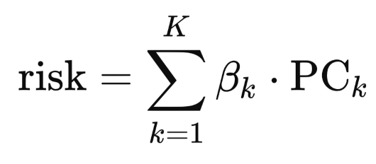
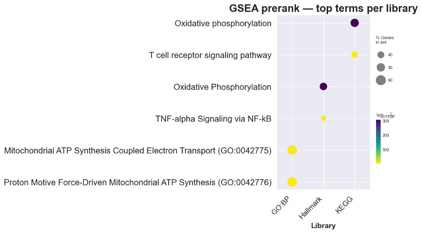

# Survival prediction in Leukemia patients with respect to toxicity and drug metabolism

## Introduction   
Leukemia is one of the most common malignancies of the hematopoietic system and affects both pediatric and adult populations. Despite substantial advances in treatment, patient outcomes remain highly heterogeneous. While some individuals respond well to therapy and achieve long-term remission, others experience severe treatment-related toxicity, early relapse, or death. Improving the accuracy of survival prediction could support more personalized treatment strategies, enabling clinicians to balance therapeutic efficacy against toxicity, particularly in vulnerable populations such as children.   

Contemporary leukemia cohorts include not only clinical variables such as age, sex, leukemia subtype, treatment protocol, and follow-up time, but also large-scale molecular (“omics”) data, including gene expression profiles. Among molecular features, genes involved in drug metabolism are of particular interest, as they influence the pharmacokinetics and pharmacodynamics of chemotherapeutic agents and may therefore affect both treatment efficacy and toxicity.   

The primary objective of this project is to develop and evaluate statistical survival models that integrate clinical variables with omics-derived biomarkers to predict survival outcomes in leukemia patients. We hypothesize that molecular features, and specifically genes involved in drug metabolism, provide additional predictive value beyond standard clinical factors and may help explain observed differences in survival between adult and pediatric patients.   
## Results   

### Clinical Data Baseline   
Survival prediction was performed using the Cox proportional hazards model. For the clinical datasets, raw data were preprocessed by removing redundant and highly collinear variables. Using clinical variables alone, concordance indices (CI) of 0.650 and 0.903 were achieved for the adult and pediatric cohorts, respectively.  

### RNA-seq Baseline   
For the transcriptomic data, RNA sequencing features were first filtered based on mean expression and variance. Subsequently, univariate Cox models were fitted for each transcript independently. Transcripts with a p-value below 0.1 were retained for downstream analysis. Despite this filtering step, substantial multicollinearity remained among the selected features, which poses challenges for Cox regression.

To address this issue, two dimensionality-reduction approaches were evaluated: principal component analysis (PCA) and weighted gene co-expression network analysis (WGCNA). Model performance, measured by the concordance index, is summarized in Table 1.   

|             | PCA on original transcript set | PCA on reduced transcript set | WGCNA on original transcript set |
|:------------|:-----------------------------------|:----------------------------------|:-------------------------------------|
|   Adults CI |                              0.691 |                             0.683 |                              0.579\* |
| Children CI |                              0.610 |                             0.691 |                                    - |

**Table 1.** Concordance indices for Cox models using different dimensionality-reduction strategies.
\*Due to inferior training-set performance relative to PCA, WGCNA was not pursued in downstream modeling   

To interpret the PCA-based Cox model in terms of the original transcripts, the following transformations were applied:

**Formula 1.** Risk score expressed as a linear combination of principal components   

**Formula 2.** Projection of Cox coefficients back to the original gene space, where W denotes the PCA loading matrix.   

This procedure enabled the construction of a ranked gene list, which was subsequently used for gene set enrichment analysis (GSEA) (Figures 1 and 2). 

    
**Figure 1.** GSEA results based on full list gene importance scores derived from the adult cohort.   

    
**Figure 2.** GSEA results based on full list gene importance scores derived from the pediatric cohort.  

Functional enrichment analysis revealed pathways associated with oxidative stress and immune response, which are expected in leukemia given the central role of redox imbalance in malignant hematopoietic cells and the immune origin of the disease, as well as the impact of chemotherapy on immune and inflammatory signaling.   

### Drug Metabolism Genes   
To specifically investigate the predictive contribution of drug metabolism–related genes, a curated list of genes was assembled and classified according to their role in drug clearance:   
- **Phase I (Functionalization):** Chemical modification of drugs, often increasing their reactivity   
- **Phase II (Conjugation):** Addition of polar groups to enhance solubility and excretion   
- **Phase III (Transport):** Active transport of drugs or metabolites out of the cell  

|                             |                                                                                          Gene |
|:----------------------------|:----------------------------------------------------------------------------------------------|
|           Oncology Specific |                                                                    DPYD, UGT1A1, TPMT, NUDT15 |
| Phase I (Functionalization) | CYP3A4, CYP3A5, CYP2D6, CYP2C9, CYP2C19, CYP2B6, CYP1A2, CYP2A6, CYP2C8, CES1, CES2, CDA, DCK |
|      Phase II (Conjugation) |                                         UGT1A9, UGT2B7, SULT, NAT1, NAT2, GSTM1, GSTT1, GSTP1 |
|    Phase III (Transporters) |       ABCB1, ABCC1, ABCC2, ABCC3, ABCG2, SLCO1B1, SLCO1B3, SLC22A1, SLC22A2, SLC47A1, SLC47A2 |

**Table 2.** Classification of drug metabolism–related genes by functions.   

Cox models trained exclusively on drug metabolism genes achieved concordance indices of 0.698 for adults and 0.613 for children. When clinical variables were added to these models, performance changed to 0.676 in adults and 0.633 in children. These results suggest that, in pediatric patients, clinical features provide additional predictive information, whereas drug metabolism genes alone are insufficient to fully capture survival risk. 
 
|                             | Drug Metabolism Genes | Drug Metabolism Genes & Clinical Data |
|:----------------------------|:----------------------|:--------------------------------------|
| Phase I (Functionalization) |    **CES1**, CES2, *CYP2D6* |                                     - |
|      Phase II (Conjugation) |                     - |                                  **NAT1** |
|    Phase III (Transporters) |               **SLC22A1** |                                     - |
|           Oncology Specific |                  **TPMT** |                                     - |

**Table 3.** Statistically significant drug metabolism genes associated with survival in adult leukemia patients. Genes in bold are statistically significant in both adults and children.   

|                             | Drug Metabolism Genes |                 Drug Metabolism Genes & Clinical Data |
|:----------------------------|:----------------------|:------------------------------------------------------|
| Phase I (Functionalization) |                CYP2C9 | CYP3A5, CYP2A6, CYP2C9, CYP2C19, **CYP2D6**, CYP3A4, **CES1** |
|      Phase II (Conjugation) |                     - |                                   **NAT1**, GSTP1, UGT1A9 |
|    Phase III (Transporters) |        **SLC22A1**, ABCC1 |                               ABCC3, SLC47A2, SLC47A1 |
|           Oncology Specific |                UGT1A1 |                                          **TPMT**, UGT1A1 |

**Table 4.** Statistically significant drug metabolism genes associated with survival in pediatric leukemia patients. Genes in bold are statistically significant in both adults and children.   

Analysis of both adult and pediatric cohorts identified five drug metabolism genes — CYP2D6, CES1, NAT1, SLC22A1, and TPMT, that were significantly associated with survival in both datasets (Table 3 and Table 4). These genes represent multiple stages of drug metabolism, indicating shared pharmacokinetic determinants of treatment outcome across age groups.   

### Relapse Prediciton   
In the pediatric cohort, relapse was analyzed as the first event due to sufficient sample size. Predictive performance for relapse was evaluated using clinical data, drug metabolism gene expression, and their combination (Table 5).   

|            | Clinical Data | Drug Metabolic Genes | Clinical and Genes |
|:-----------|:--------------|:---------------------|:-------------------|
| Relapse CI |         0.606 |                0.615 |              0.660 |
|   Death CI |         0.674 |                0.605 |              0.660 |

**Table 5.** Concordance indices for Cox models using different target events.   

Integrating clinical and molecular features improved relapse prediction compared with either type of data alone. Also, results suggest that drug metabolism genes add prognostic value for relapse risk in pediatric leukemia, while overall survival is mainly driven by clinical factors.   

Analysis of significant covariates revealed that several drug metabolism genes—including UGT1A1, NUDT15, CYP2C9, CYP2C19, CYP2C8, CES1, and ABCC3—were associated with relapse risk in RNA-only models. When combining RNA and clinical features, CES1 remained the only statistically significant predictor, emphasizing its role in relapse beyond clinical variables.   

## Discussion   
Our analysis shows that combining clinical and molecular data can improve understanding of factors affecting survival in leukemia patients.   

One of the most notable findings was the identification of five drug metabolism genes: CYP2D6, CES1, NAT1, SLC22A1, and TPMT, that were significant in both adult and pediatric cohorts. These genes cover multiple stages of drug processing. CYP2D6 and CES1 are involved in drug activation and breakdown, affecting how chemotherapy is metabolized. NAT1 helps detoxify drugs through conjugation, while SLC22A1 functions as a transporter, controlling drug uptake and distribution within cells. TPMT, already well-known clinically, influences thiopurine metabolism and dosing. The fact that these genes were consistently identified in both age groups suggests they play a central, age-independent role in determining treatment outcomes, making them promising candidates for guiding personalized therapy.  

Our model comparisons provide additional insight. Clinical data alone produced high concordance in children but only moderate performance in adults, likely due to greater heterogeneity in adult disease and treatments.   

Integrating clinical and drug metabolism features improved predictions in children in comparison to drug metabolism genes alone, highlighting that both types of information are needed for accurate risk assessment, while in adults, drug metabolism genes alone captured much of the survival signal.   

Relapse in pediatric leukemia is strongly influenced by variability in drug metabolism in addition to classical clinical risk factors. CES1, a carboxylesterase that activates or inactivates ester-containing chemotherapeutics, remained associated with relapse even when clinical variables were included. Other key pharmacogenes include NUDT15 (thiopurine detoxification), UGT1A1 (glucuronidation), CYP2C8/2C9/2C19 (drug activation and clearance), and ABCC3 (drug efflux), all of which affect intracellular drug levels and treatment efficacy. By contrast, overall survival in pediatric leukemia is primarily shaped by clinical factors, which may explain why these molecular markers are more strongly linked to relapse than to long-term survival, emphasizing the potential of pharmacogene profiling to identify high-risk patients and guide therapy optimization.   

Overall, these results suggest that survival in leukemia is shaped by a combination of clinical context and molecular mechanisms, particularly genes affecting drug metabolism. Future work should validate these findings in larger cohorts, explore functional roles of the identified genes, and test whether incorporating these markers into treatment planning can improve outcomes for both pediatric and adult patients.   

## Credits   
This work is done by Viktor Nekrasov, LS-1 (analysis of pediatric cohort) and Stepan Epifantsev, DS-1 (analysis of adult cohort).   

## References   
[Pediatric Acute Lymphoid Leukemia - Phase II](https://www.cbioportal.org/study/summary?id=all_phase2_target_2018_pub)

[Chronic Lymphocytic Leukemia](https://www.cbioportal.org/study/summary?id=cll_broad_2022)
